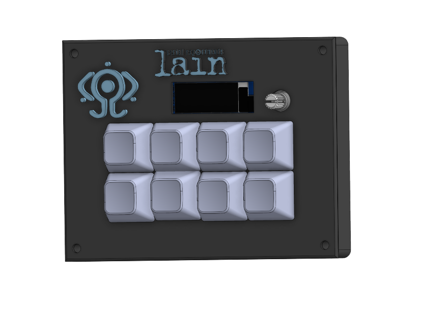
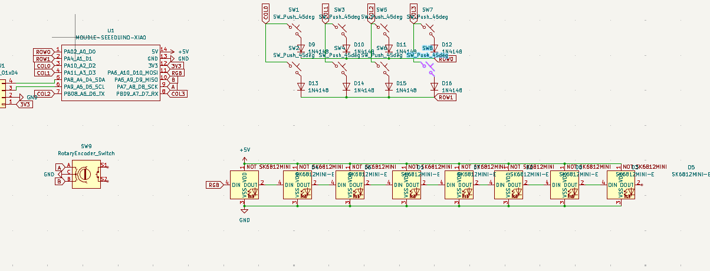
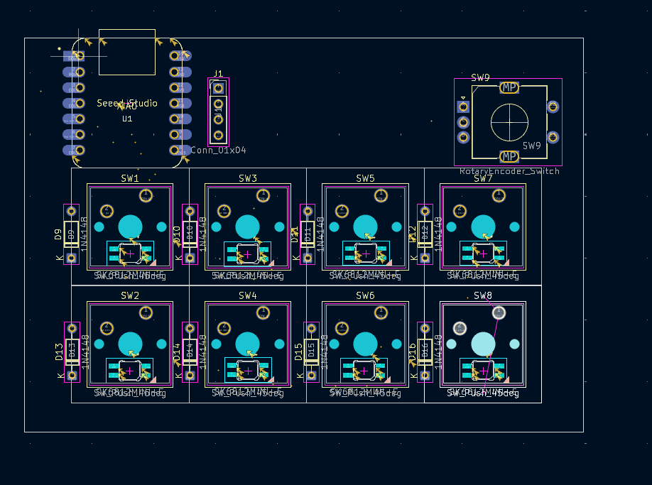
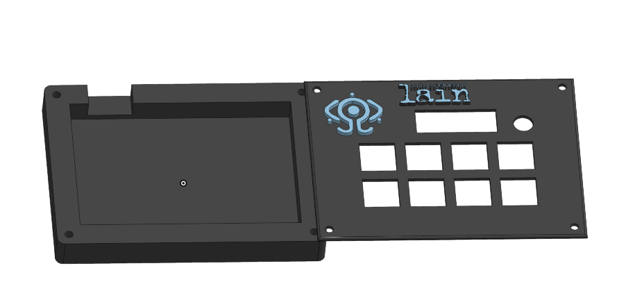

# HACKCLUB‑Hackpad

A compact macropad project including PCB, schematic, and a fitted case inspired by Serial Experiments Lain.

**Overview**

This repository contains the design files, a simple KMK firmware, and placeholder screenshots for a small 8-key macropad with rotary encoder, underglow LEDs, and a 0.91" OLED.

**Screenshots**









**Bill of Materials (BOM)**
- Seeed XIAO RP2040 — x1
- Through-hole 1N4148 diodes — x8
- MX-style mechanical switches — x8
- EC11 rotary encoder — x1
- Blank DSA keycaps — x8
- SK6812 MINI-E LEDs — x8
- 0.91 inch OLED display — x1
- M3 x 16 mm screws & M3 heat-set inserts — x4

**Repository layout**
- `cad/` — CAD files and case models
- `pcb/` — KiCad schematic and PCB files
- `firmware/` — KMK firmware and `keymap.py`
- `docs/images/` — project screenshots used by this README

**Build & flash (quick)**
1. Assemble PCB and solder components following the schematic in `pcb/`.
2. To program the Seeed XIAO RP2040 with KMK, install KMK according to its docs on your host system and copy `firmware/keymap.py` to the device using one of these methods:

	 - Thonny: open the board and copy `keymap.py` to the device filesystem.
	 - `mpremote`:

		 ```powershell
		 mpremote connect serial run firmware\keymap.py
		 ```

	 - If your workflow requires a UF2, build the firmware binary and flash according to the KMK/board instructions.

**Usage**
- The encoder controls system volume (rotate) and mute (press). The OLED displays current layer and a volume indicator when available. Adjust pins in `firmware/keymap.py` if your PCB routing differs.

**Files to replace**
- Replace the placeholder images in `docs/images/`, `cad/`, and `pcb/` with your final screenshots to have them show up on GitHub.

If you want, I can also replace the placeholder image files with the attachments and push them. Tell me to proceed and I'll add the four images and push a commit.
